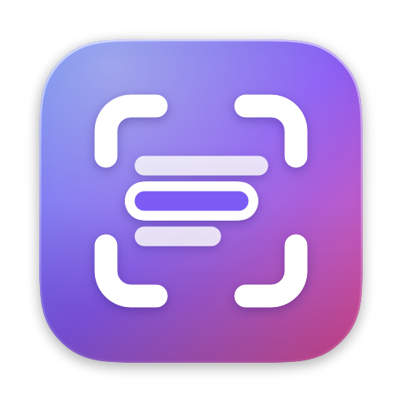
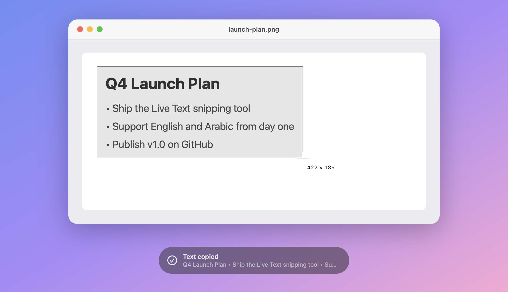
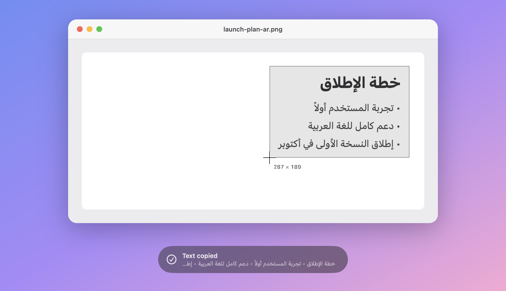
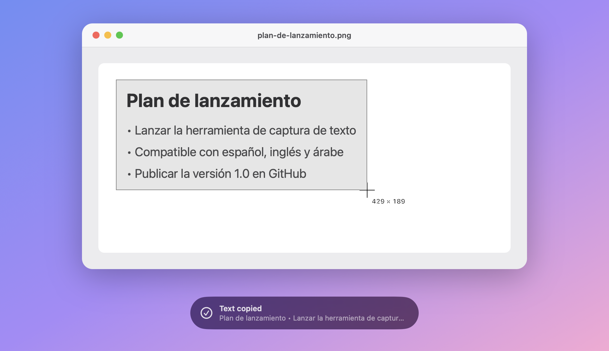

<p align="center">
  
</p>

<h1 align="center">LiveSnip</h1>

<p align="center">
  Copy text from anywhere on your screen with Apple's Live Text.
</p>

<p align="center">
  <a href="https://eman.sa/livesnip/"><strong>Website</strong></a> ·
  <a href="https://github.com/Eman-x/LiveSnip/releases/latest/download/LiveSnip.zip"><strong>Download for Mac</strong></a>
</p>

<p align="center">
  <a href="https://github.com/Eman-x/LiveSnip/releases/latest"></a>
  
  <a href="LICENSE"></a>
</p>

LiveSnip is a small menu bar app for macOS, like TextSniper but free and open source. Press **⇧⌘2**, drag over any text (in an image, a video, a scanned PDF, or an app that won't let you select it), and the text is on your clipboard.



## Features

- **Live Text accuracy.** Uses VisionKit's `ImageAnalyzer`, the same on-device engine as Live Text in Photos and Preview. Your captures never leave your Mac.
- **English, Arabic, Spanish, and more.** Reads every language Live Text does, accents and right-to-left text included. That also covers Chinese, Japanese, Korean, French, German, Portuguese, and others.
- **Your shortcut.** Keep ⇧⌘2 or record any shortcut you like.
- **Stays out of the way.** Lives in the menu bar, can open at login, confirms each copy with a small toast, and never steals focus.
- **Keep or join lines.** Keep the original line breaks, or turn them off to get one clean paragraph.
- **Updates itself.** Checks for new versions once a day and installs them in place, but only when they're signed with LiveSnip's own certificate.

<p align="center">
  
  
</p>

## Install

1. Download the zip from [eman.sa/livesnip](https://eman.sa/livesnip/) or the [latest release](https://github.com/Eman-x/LiveSnip/releases/latest), unzip it, and move **LiveSnip** to **Applications**.
2. Open it. LiveSnip isn't notarized by Apple, so macOS blocks the first launch. Go to **System Settings → Privacy & Security**, scroll down, and click **Open Anyway**.
3. LiveSnip opens its **Permissions** tab. Click **Open System Settings**, turn LiveSnip on under **Screen & System Audio Recording**, then choose **Quit & Reopen**. A green check confirms it's done. This lets it see other apps' windows.

Requires macOS 26 Tahoe or later, on Apple Silicon or Intel.

## Usage

| Press | To |
| --- | --- |
| **⇧⌘2**, then drag | Copy the text in an area |
| **⇧⌘2**, then **Space**, then click a window | Copy the text in a window |
| **Esc** | Cancel |

To use a different shortcut, choose **Change Shortcut…** from the menu bar icon and press the keys you want. To start LiveSnip with your Mac, choose **Open at Login**. **Settings…** has all of this plus the permission status, and its **About** tab has a **Send Feedback** button. If your menu bar is too full to show the icon, open LiveSnip again from Applications or Spotlight to get the settings window.

LiveSnip shows in the Dock while it's open. Quit it from the Dock and it can keep running in the menu bar instead; choose what happens in **Settings → General**. The menu bar menu also has **Keep Line Breaks**, **Check for Updates…**, and **Quit**.

LiveSnip also reads image files from the terminal:

```sh
/Applications/LiveSnip.app/Contents/MacOS/LiveSnip --ocr screenshot.png
```

## Build from source

You need Xcode 26, or the Command Line Tools with the macOS 26 SDK.

```sh
git clone https://github.com/Eman-x/LiveSnip.git
cd LiveSnip
./build.sh install
```

`./build.sh` builds `build/LiveSnip.app` and a release zip, and `install` also copies the app to `~/Applications` and launches it.

Releases are signed with a self-signed certificate named **LiveSnip Signing** (in Keychain Access: Certificate Assistant → Create a Certificate, type Code Signing). A stable certificate keeps LiveSnip's Screen Recording permission across updates, and the updater only installs builds signed with it. Without it, `./build.sh` makes an ad-hoc build that can't update itself.

## License

[MIT](LICENSE)
